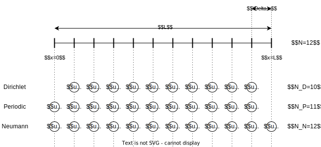

# PDEquinox

A collection of neural operator architecture for the image-to-image application,
most often encountered in autoregressive learning; built on top of
[Equinox](https://github.com/patrick-kidger/equinox).

They are designed to map between states (=discretized functions).

    ! boundary modes so far only in homoegenous mode (homogeneous dirichlet & neumann, and periodic)

### Constructors

You find many common architectures in the `pdequinox.arch` submodule. They build
on the two primary constructor paradigms:

A sequential network constructor.

A hierarchical network constructor.

The squential network constructor is defined by:
* a lifting block $\mathcal{L}$
* $N$ blocks $\left \{ \mathcal{B}_i \right\}_{i=1}^N$
* a projection block $\mathcal{P}$
* the hidden channels within the sequential processing
* the number of blocks $N$ (one can also supply a list of hidden channels if they shall be different between blocks)

The hierarchical network constructor is defined by:
* a lifting block $\mathcal{L}$
* The number of levels $D$ (i.e., the number of additional hierarchies). Setting $D = 0$ recovers the sequential processing.
* a list of $D$ blocks $\left \{ \mathcal{D}_i \right\}_{i=1}^D$ for
  downsampling, i.e. mapping downwards to the lower hierarchy (oftentimes this
  is that they halve the spatial axes while keeping the number of channels)
* a list of $D$ blocks $\left \{ \mathcal{B}_i^l \right\}_{i=1}^D$ for
  processing in the left arc (oftentimes this changes the number of channels,
  e.g. doubles it such that the combination of downsampling and left processing
  halves the spatial resolution and doubles the feature count)
* a list of $D$ blocks $\left \{ \mathcal{U}_i \right\}_{i=1}^D$ for upsamping,
  i.e., mapping upwards to the higher hierarchy (oftentimes this doubles the
  spatial resolution; at the same time it halves the feature count such that we
  can concatenate a skip connection)
* a list of $D$ blocks $\left \{ \mathcal{B}_i^r \right\}_{i=1}^D$ for
  processing in the right arc (oftentimes this changes the number of channels,
  e.g. halves it such that the combination of upsampling and right processing
  doubles the spatial resolution and halves the feature count)
* a projection block $\mathcal{P}$
* the hidden channels within the hierarchical processing (if just an integer is
  provided; this is assumed to be the number of hidden channels in the highest
  hierarchy.)

For completion, `pdequinox.arch` also provides a `ConvNet` which is a simple
feed-forward convolutional network. It also provides `MLP` which is a dense
networks which also requires pre-defining the number of resolution points.

Architectures in `PDEquinox` are designed with physical fields in mind, each
network can select its boundary mode out of the following options:
* `periodic`
* `dirichlet`
* `neumann`

For higher dimensional problems, it is assumed that the mode is the same for all
boundaries.

### Boundary condition

All major modes of boundary conditions on physical fields are supported. Note
however, how the boundary condition changes what is considered a degree of
freedom

