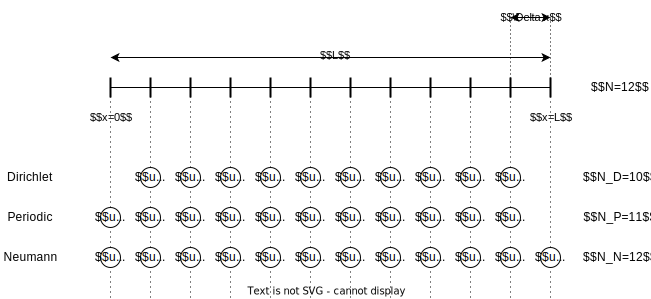

# More Details

## Background

Neural Emulators are networks learned to efficienty predict physical phenomena,
often associated with PDEs. In the simplest case this can be a linear advection
equation, all the way to more complicated Navier-Stokes cases. If we work on
Uniform Cartesian grids* (which this package assumes), one can borrow plenty of
architectures from image-to-image tasks in computer vision (e.g., for
segmentation). This includes:

* Standard Feedforward ConvNets
* Convolutional ResNets ([He et al.](https://arxiv.org/abs/1512.03385))
* U-Nets ([Ronneberger et al.](https://arxiv.org/abs/1505.04597))
* Dilated ResNets ([Yu et al.](https://arxiv.org/abs/1511.07122), [Stachenfeld et al.](https://arxiv.org/abs/2112.15275))
* Fourier Neural Operators ([Li et al.](https://arxiv.org/abs/2010.08895))

It is interesting to note that most of these architectures resemble classical
numerical methods or at least share similarities with them. For example,
ConvNets (or convolutions in general) are related to finite differences, while
U-Nets resemble multigrid methods. Fourier Neural Operators are related to
spectral methods. The difference is that the emulators' free parameters are
found based on a (data-driven) numerical optimization not a symbolic
manipulation of the differential equations.

(*) This means that we essentially have a pixel or voxel grid on which space is
discretized. Hence, the space can only be the scaled unit cube $\Omega = (0,
L)^D$

## Boundary Conditions

This package assumes that the boundary condition is baked into the neural
emulator. Hence, most components allow setting `boundary_mode` which can be
`"dirichlet"`, `"neumann"`, or `"periodic"`. This affects what is considered a
degree of freedom in the grid.

Dirichlet boundaries fully eliminate degrees of freedom on the boundary.
Periodic boundaries only keep one end of the domain as a degree of freedom (This
package follows the convention that the left boundary is the degree of freedom). Neumann boundaries keep both ends as degrees of freedom.

## Constructors

There are two primary architectural constructors for Sequential and Hierarchical
Networks that allow for composability with the `PDEquinox` blocks.

### Sequential Constructor

The squential network constructor is defined by:
* a lifting block $\mathcal{L}$
* $N$ blocks $\left \{ \mathcal{B}_i \right\}_{i=1}^N$
* a projection block $\mathcal{P}$
* the hidden channels within the sequential processing
* the number of blocks $N$ (one can also supply a list of hidden channels if they shall be different between blocks)

### Hierarchical Constructor

The hierarchical network constructor is defined by:
* a lifting block $\mathcal{L}$
* The number of levels $D$ (i.e., the number of additional hierarchies). Setting $D = 0$ recovers the sequential processing.
* a list of $D$ blocks $\left \{ \mathcal{D}_i \right\}_{i=1}^D$ for
  downsampling, i.e. mapping downwards to the lower hierarchy (oftentimes this
  is that they halve the spatial axes while keeping the number of channels)
* a list of $D$ blocks $\left \{ \mathcal{B}_i^l \right\}_{i=1}^D$ for
  processing in the left arc (oftentimes this changes the number of channels,
  e.g. doubles it such that the combination of downsampling and left processing
  halves the spatial resolution and doubles the feature count)
* a list of $D$ blocks $\left \{ \mathcal{U}_i \right\}_{i=1}^D$ for upsamping,
  i.e., mapping upwards to the higher hierarchy (oftentimes this doubles the
  spatial resolution; at the same time it halves the feature count such that we
  can concatenate a skip connection)
* a list of $D$ blocks $\left \{ \mathcal{B}_i^r \right\}_{i=1}^D$ for
  processing in the right arc (oftentimes this changes the number of channels,
  e.g. halves it such that the combination of upsampling and right processing
  doubles the spatial resolution and halves the feature count)
* a projection block $\mathcal{P}$
* the hidden channels within the hierarchical processing (if just an integer is
  provided; this is assumed to be the number of hidden channels in the highest
  hierarchy.)

### Beyond Architectural Constructors

For completion, `pdequinox.arch` also provides a `ConvNet` which is a simple
feed-forward convolutional network. It also provides `MLP` which is a dense
networks which also requires pre-defining the number of resolution points.

## Related

Similar packages that provide a collection of emulator architectures are
[PDEBench](https://github.com/pdebench/PDEBench) and
[PDEArena](https://github.com/pdearena/pdearena). With focus on Phyiscs-informed
Neural Networks and Neural Operators, there are also
[DeepXDE](https://github.com/lululxvi/deepxde) and [NVIDIA
Modulus](https://developer.nvidia.com/modulus).